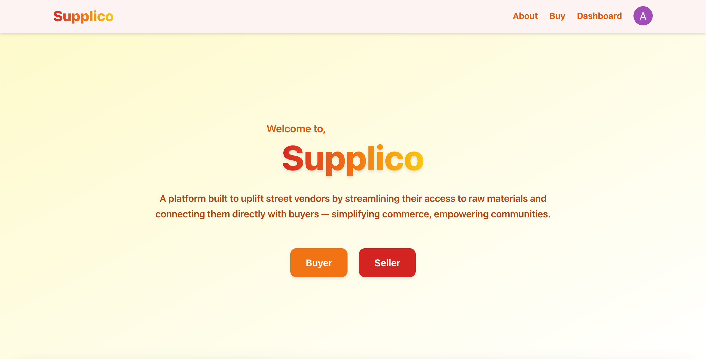
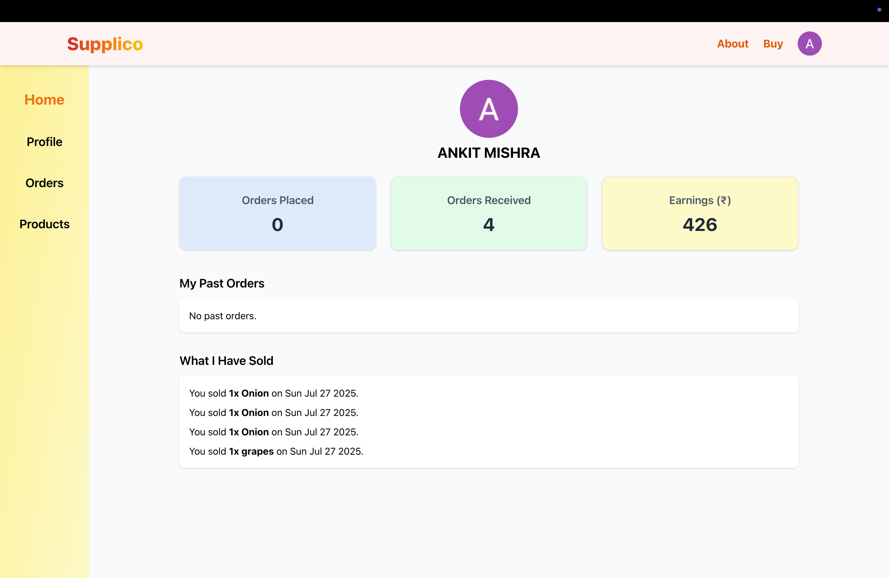
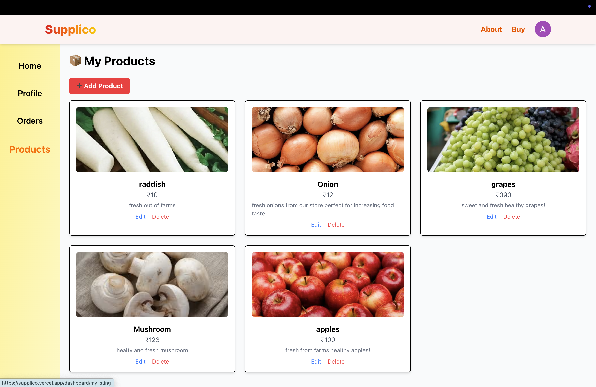
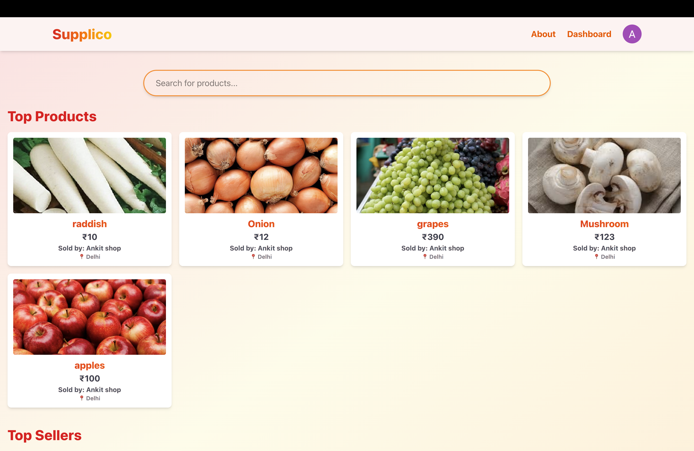

# 🧑‍💻 DEV G - Web Development Hackathon Submission

Welcome to the official repository of **Team DEV G** for the **Tutedude Web Development Hackathon**.

## 🚀 Project Overview

This project was built as part of Tutedude's Web Development Hackathon to solve real-world challenges using web technologies. We focused on innovation, usability, and impactful design to bring our idea to life.

## 🏆 Hackathon Details

- **Event:** Tutedude Web Development Hackathon  
- **Category:** Web Development  
- **Team Name:** DEV G  
- **Team Members:**
  - Ankit Mishra  
  - Nishant Pal  
  - Amit Kumar  

## 💡 Our Solution

We built a smart e-commerce platform aimed at helping Indian street food vendors source raw materials affordably. The platform includes features like adding your own product, add your shop, and real-time supplier discovery.

## 🛠️ Tech Stack

- **Frontend:** React.js (Next.js), Tailwind CSS  
- **Backend:** Firebase Firestore  
- **Authentication:** Firebase Auth  
- **Image Handling:** ImgBB API  
- **Deployment:** Vercel

## 📸 Screenshots

### Homepage

### Dashboard

### Add Products Page

### Buyer Page

## 🧑‍🤝‍🧑 Team Contributions

- **Ankit Mishra** – Frontend & Firebase Integration  
- **Nishant Pal** – UI/UX Design & Routing  
- **Amit Kumar** – Backend Logic & Database Structuring  

## 📬 Contact

If you’d like to get in touch or learn more, feel free to reach out to us!

---

Thanks for checking out our project. We hope you like it! 🙌
